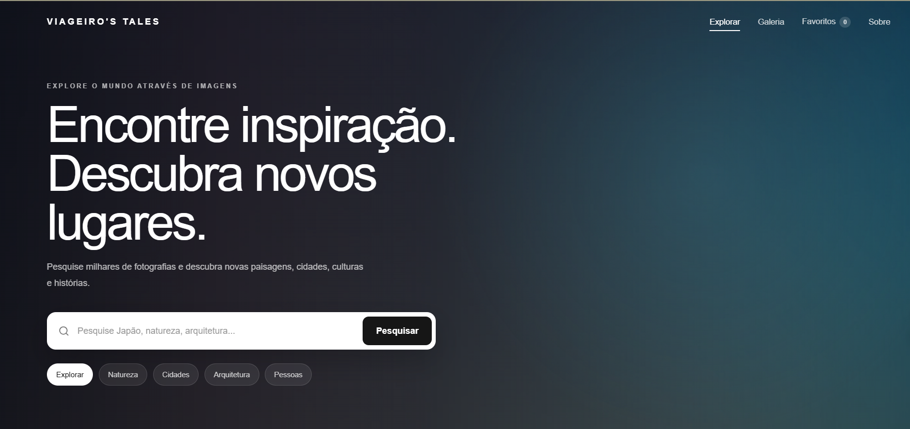

# 🌍 Viageiro's Tales

Uma galeria de imagens responsiva desenvolvida para explorar fotografias de diferentes lugares, cidades, paisagens, arquiteturas e culturas ao redor do mundo.

O projeto começou como uma aplicação frontend e evoluiu para uma aplicação com integração entre **JavaScript e backend Python/Flask**, utilizando a API da Pexels de forma segura.

🔗 **Demo:** https://galeria-blond.vercel.app/

---

## 📸 Sobre o projeto

O **Viageiro's Tales** permite pesquisar e explorar fotografias utilizando dados obtidos dinamicamente através da API da Pexels.

A aplicação possui uma interface inspirada em plataformas de descoberta visual, com foco em experiência do usuário, responsividade e organização das imagens.

A chave da API não é exposta no frontend. As requisições passam por uma API intermediária desenvolvida com Flask.

---

## ✨ Funcionalidades

- 🔎 Pesquisa de imagens
- 🏷️ Pesquisa por categorias
- 🖼️ Galeria responsiva
- ♾️ Infinite Scroll
- ❤️ Sistema de favoritos com Local Storage
- 🔍 Visualização ampliada das fotografias
- ⌨️ Navegação pelo modal utilizando teclado
- 📱 Layout responsivo para diferentes tamanhos de tela
- 💀 Skeleton Loading durante o carregamento
- ⬆️ Botão para voltar ao topo
- 🔐 API Key protegida no backend
- 🚦 Rate Limiting na API
- ⚠️ Tratamento de erros da API
- 🌐 Deploy integrado na Vercel

---

## 🛠️ Tecnologias

### Frontend

- HTML5
- CSS3
- JavaScript
- Fetch API
- Local Storage
- Intersection Observer API

### Backend

- Python
- Flask
- Flask-CORS
- Flask-Limiter
- Requests
- python-dotenv

### Infraestrutura

- Git
- GitHub
- Vercel
- Environment Variables

### API externa

- Pexels API

---

## 🏗️ Arquitetura

```text
Usuário
   │
   ▼
Frontend
HTML + CSS + JavaScript
   │
   │ GET /api/images
   ▼
Flask API
   │
   │ Authorization
   ▼
Pexels API
   │
   ▼
Flask filtra a resposta
   │
   ▼
JSON
   │
   ▼
Galeria
```

O frontend não possui acesso direto à chave da Pexels.

A variável:

```text
PEXELS_API_KEY
```

fica armazenada somente no ambiente do servidor.

---

## 🔐 Segurança

Algumas medidas foram implementadas para evitar exposição de informações sensíveis.

### Variáveis de ambiente

A chave da Pexels é armazenada em:

```text
backend/.env
```

Esse arquivo não é versionado pelo Git.

O repositório disponibiliza apenas:

```text
backend/.env.example
```

como exemplo de configuração.

### Backend como proxy

O navegador não realiza requisições autenticadas diretamente para a Pexels.

O fluxo utilizado é:

```text
Frontend
   ↓
Flask API
   ↓
Pexels
```

Dessa forma, a credencial permanece no servidor.

### Rate Limiting

A API possui limitação de requisições para reduzir chamadas excessivas ao endpoint.

### Validação

O backend valida parâmetros como:

- termo pesquisado;
- página;
- quantidade de resultados;
- disponibilidade da API externa.

---

## 📂 Estrutura do projeto

```text
galeria/
│
├── backend/
│   ├── app.py
│   ├── requirements.txt
│   └── .env.example
│
├── index.html
├── style.css
├── java.js
├── bg.jpg
├── vercel.json
├── .gitignore
└── README.md
```

---

## 💻 Executando localmente

### 1. Clone o projeto

```bash
git clone https://github.com/Everttoncrd/galeria.git
```

Entre na pasta:

```bash
cd galeria
```

### 2. Crie um ambiente virtual

Windows:

```bash
python -m venv .venv
```

Ative:

```bash
.venv\Scripts\activate
```

### 3. Instale as dependências

```bash
pip install -r backend/requirements.txt
```

### 4. Configure a variável de ambiente

Crie:

```text
backend/.env
```

Utilize como referência:

```text
backend/.env.example
```

Configure:

```env
PEXELS_API_KEY=sua_chave_aqui
```

> Nunca publique sua chave real no GitHub.

### 5. Execute o backend

```bash
cd backend
python app.py
```

A API estará disponível localmente em:

```text
http://127.0.0.1:5000
```

Depois abra o frontend utilizando o **Live Server**.

---

## 🔌 Endpoints

### Health Check

```http
GET /api/health
```

Exemplo:

```json
{
  "service": "gallery-api",
  "status": "ok"
}
```

### Pesquisar imagens

```http
GET /api/images?query=japan&page=1&per_page=20
```

Parâmetros:

| Parâmetro | Descrição |
|---|---|
| `query` | Termo utilizado na pesquisa |
| `page` | Página dos resultados |
| `per_page` | Quantidade de imagens |

---

## 🚀 Deploy

A aplicação está publicada na **Vercel**.

Em produção, o frontend utiliza:

```text
/api/images
```

permitindo que frontend e backend utilizem o mesmo domínio.

A variável `PEXELS_API_KEY` é configurada diretamente nas Environment Variables da plataforma.

---

## 📚 Aprendizados

Durante o desenvolvimento deste projeto foram trabalhados conceitos como:

- consumo de APIs REST;
- integração frontend/backend;
- programação assíncrona;
- manipulação do DOM;
- persistência utilizando Local Storage;
- Infinite Scroll;
- tratamento de erros;
- desenvolvimento de APIs com Flask;
- proteção de credenciais;
- variáveis de ambiente;
- CORS;
- Rate Limiting;
- Git e GitHub;
- deploy de aplicações web.

---

## 👨‍💻 Autor

**Evertton Cardoso**

Desenvolvedor Júnior com foco em desenvolvimento web, estudando e construindo projetos utilizando Python, JavaScript, React, SQL e APIs REST.

GitHub: https://github.com/Everttoncrd



---

⭐ Se este projeto foi útil ou interessante, considere deixar uma estrela no repositório.
